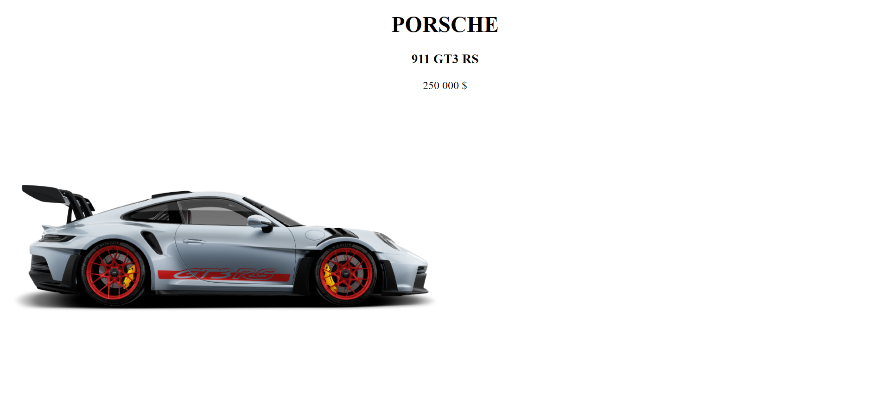
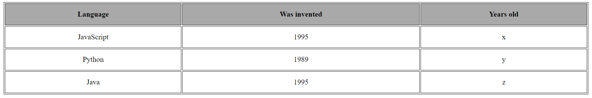
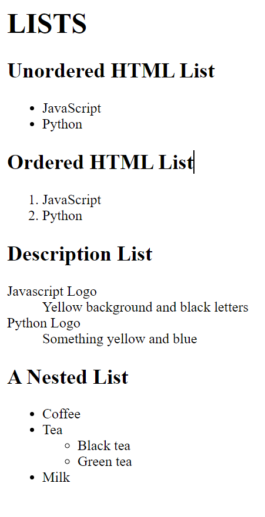
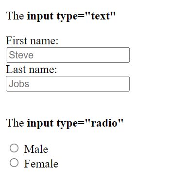
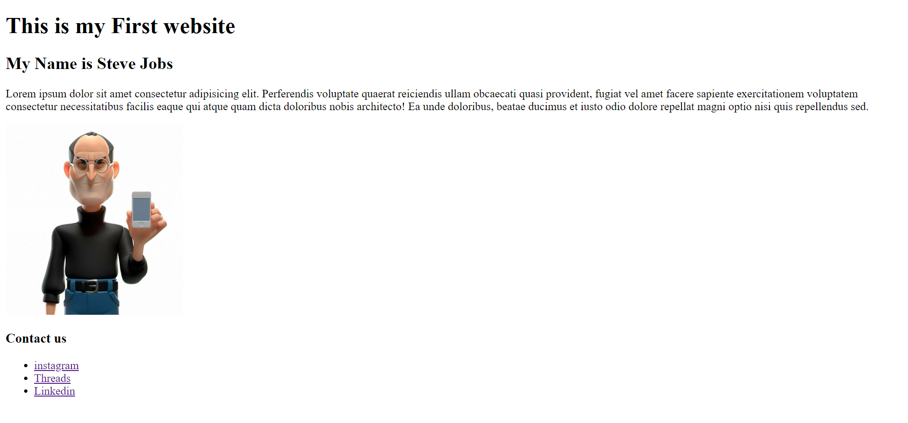

# HTML  :beginner:

We require you to solve the following tasks and place them in different sections of the **index.html** file. Remember to read the requirements first.\
**Note**: *The images to be used in solving the tasks are placed in the **images** folder.*  

#### Topics you need to know and use to solve tasks

* HTML Attributes
* HTML Headings
* HTML Text Formatting 
* HTML Links - Hyperlinks
* HTML Images
* HTML Tables
* HTML Lists
* HTML Layout Elements
* HTML Form and inputs

**Final Notes**: *Remember to solve and send assignments on time* :hourglass_flowing_sand:

## Assignment 1   :star:

### Description
1. Bring the headings to the center of the page.
2. Add an Porsche image to the page as shown below.
3. Specify the width and height of an image with the width and height attributes.

## Assignment 2   :star:

### Description

1. Create an image with the tech academy logo that links to the tech academy site when you click on it

*Tip: The text color is #11c7f2, and text font-family is Arial🫡*

## Assignment 3   :star: :star:

### Description

1. Use the border attribute to add a border to the table.
2. Table has 100%  width and 200px  height.

*Tip: The th background-color is darkgrey🫡*

## Assignment 4   :star:  :star:

### Description

1. Create html list types according to the image below.

*Optional:You can be the coolest in the team by adding interesting styles.😎*

## Assignment 5   :star:  :star:

### Description
1. HTML also has different inputs.Write different inputs and as shown below write input type in the paragraph tag.

*Attention:You must write at least 5 inputs.🆘*

 

## Assignment 6  :star:  :star: :star:

### Description

1. Create a simple html page that matches the image below

*Optional:You can be the coolest in the team by adding interesting styles.😎*

:copyright: **Elmir Huseynov**

